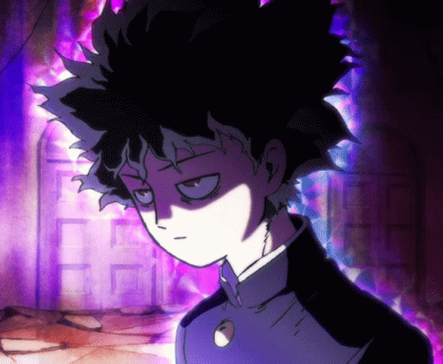
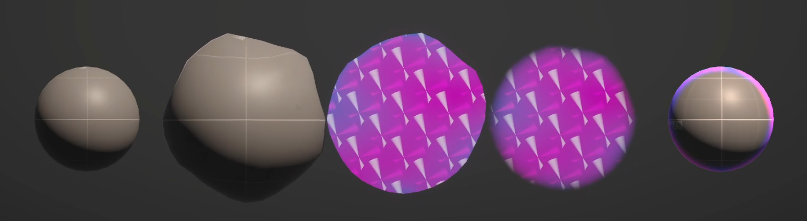

<!--
Hey, thanks for using the awesome-readme-template template.  
If you have any enhancements, then fork this project and create a pull request 
or just open an issue with the label "enhancement".

Don't forget to give this project a star for additional support ;)
Maybe you can mention me or this repo in the acknowledgements too
-->

  
  
  <h1>Mob Psycho Aura (Unity/Shader Graph)</h1>

  
## About

This is my attempt at recreating the aura effect from the anime Mob Psycho 100. Made with Shader Graph and Unity 2022.2.19f1.

### Details

 
  

 

The implementation involves a mixture of the following:
- Vertex displacement to expand the aura's volume
- Creating a tileable 'spinning disk' texture to emulate the original design
- Screen space texture mapping
- Fresnel effect to soften the edges of the aura volume
- Fresnel effect to simulate reflective lighting onto the object itself
- Two-pass render to render the aura before the object in order to create an outline effect

The final result looks like this:

 
  

 

And for fun, I decided to make a sample cinematic with the effect applied onto Unity-chan.

 
  

